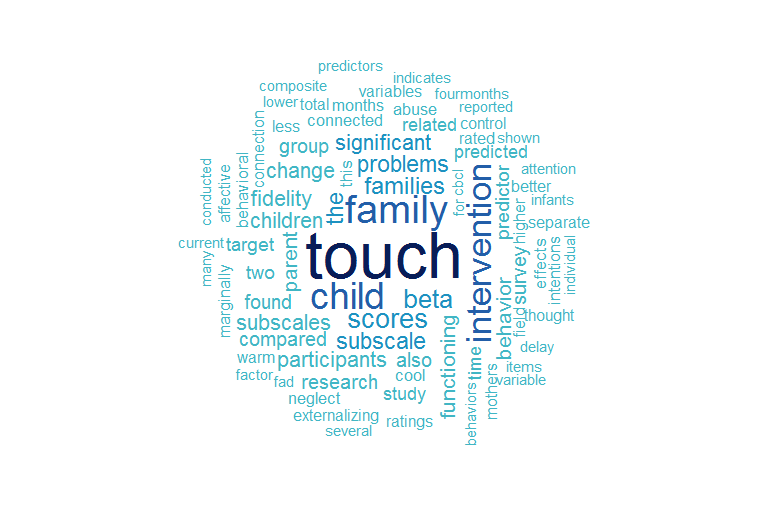

  
##Jacquelyn Pennings, Ph.D., PStat®  

My degrees are from Belmont University (B.S.) and Texas Christian University (M.S. & Ph.D.). Go Horned Frogs!  

I am accredited as a Accredited Professional Statistician by the American Statistical Association.  

I am currently a biostatistician at Vanderbilt University Medical Center. I also do statistical consulting work for Elite Research.

###Dissertation
  
My dissertation in a wordcloud. *The Effects of a Touch Intervention on Nurturing Touch, Family Functioning, and Child Behavior*
  
  
###Publications
1. Rus, A., Stativa, E., Butterfield, M., **Pennings, J.**, Parris, S., Burcea, G., Wenyika, R. (In press). Peer Exploitation: Findings from a Romanian Nationally Representative Sample of Children Living in Long-Term Residential Centres. Child Abuse Review. Accepted for publication Oct. 11, 2016.  

2. Rhea, D.J., Rivchun, A.P., & **Pennings, J.** (2016). The Liink Project: Implementation of a Recess and Character Development Pilot Study with Grades K & 1 Children. Texas Association of Health, Physical Education, Recreation, & Dance Journal (TAHPERD), 84(2), 14-17.  

3. Stativa, E., Rus, A.V., Stanescu, A., **Pennings, J.S.**, Parris, S.R. & Wenyika, R. (In press). Prevalence and Predictors of Anaemia in Romanian Infants 6-23 Months Old. Journal of Public Health. First published online October 22, 2015 doi:10.1093/pubmed/fdv145  

4. Fredland, N., McFarlane, J., Symes, L., Maddoux, J., **Pennings, J.**, Paulson, R., Binder, B. & Gilroy, H. (2016). Modeling the intergenerational impact of partner abuse on maternal and child function at 24 months post outreach: Implications for practice and policy. Nursing Outlook, 64(2), 156-169. doi:10.1016/j.outlook.2015.10.005  

5. Symes, L., Maddous, J., McFarlane, J. **Pennings, J.** (2016). A risk assessment tool to predict sustained PTSD symptoms among women reporting abuse. Journal of Women's Health, 25(4), 340-347. doi:10.1089/jwh.2015.5287.  

6. McFarlane, J., **Pennings, J.**, Liu, F.Q., Gilroy, H., Nava, A., Maddoux, J., Montalvo-Liendo, N., & Paulson, R. (2016). Predicting abused women with children who return to a shelter: Development and use of a rapid assessment triage tool. Violence Against Women, 22(2), 189-205  

7. Daniels, G., Robinson, J.R., Walker, C., **Pennings, J.S.**, Anderson, S.T. (2015). Gastrointestinal Symptoms among African Americans Undergoing Hemodialysis. Nephrology Nursing Journal, 42(6), 539-548.  

8. **Pennings. J.**, McFarlane, J., Paulson, R., Fredland, N., Binder, B., Koci, A., & MontalvoLiendo, N. (2015). Predicting Behavioral Dysfunctions of Youth Living in Violent Homes: A Rapid Assessment Triage Tool. Journal of Applied Research on Children: Informing Policy for Children at Risk, 6(1), Article 11.  

9. Alexander, G.K., Rollins, K., Walker, D., Wong, L., & **Pennings, J.** (2015). Yoga for self-care and burnout prevention among nurses. Workplace Health & Safety, 63(10), 462-470.  

10. Fredland, N., McFarlane, J., Symes, L., Gilroy, H., Paulson, R., Nava, A., & **Pennings, J.S.**  (2015). Connecting Partner Violence to Poor Functioning for Women and Children: Modeling Intergenerational Outcomes. Journal of Family Violence, 30(5), 555-566.  

11. McFarlane, J., **Pennings, J.**, Symes, L., Maddoux, J., & Paulson, R. (2014). Predicting Abused Women with Children Who Return to the Abuser: Development of a Risk Assessment Tool. Journal of Threat Assessment and Management, 1(4), 274-290.  

12. Stativa, E. Rus, A.V., Suciu, N., **Pennings, J.S.**, Butterfield, M.E., Wenyika, R., & Webster, R. (2014). Characteristics and prenatal care utilisation of Romanian pregnant women. The European Journal of Contraception and Reproductive Health Care, 19(3), 220-226.  

13. Rus, A. V., Stativa, E., **Pennings, J. S.**, Cross, D. R., Ekas, N., Purvis, K., & Parris, S.R. (2013). Severe Punishment of Children by Staff in Romanian Placement Centers for School-Aged Children: Effects of Child and Institutional Characteristics. Child Abuse and Neglect, 37(12) 1152-1162.  

14. Dietz, T., Davis, D, & **Pennings, J. S.** (2012). Evaluating and Comparing the Efficacy of Three Group Therapies for Child Sexual Abuse: The Effect of Incorporating Animal Assisted Therapy, Journal of Child Sexual Abuse, 21(6), 665-683 

15. Purvis, K. B., Cross, D. R., & **Pennings, J. S.** (2009). Trust-Based Relational InterventionT: Interactive Principles for Adopted Children With Special Social-Emotional Needs. Journal of Humanistic Counseling, Education & Development, 49, 3-22.  

16. Purvis, K. B., Cross, D. R., & **Pennings, J. S.** (2007). International adoption of postinstitutionalized children: Implications for school counselors. Journal of School Counseling, 5(22). Retrieved December 3, 2007, from http://jsc.montana.edu/articles/v5n22.pdf  

17. Purvis, K., Cross, D., Kellermann, G., Kellermann, M., Huisman, H, & **Pennings, J. S.** (2006). An experimental evaluation of targeted amino acid therapy with behaviorally at-risk children. Journal of Alternative and Complementary Medicine, 11, 591-593.  
